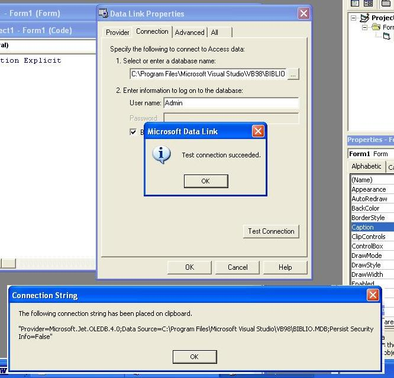



## ADO Connection String Builder Add\-In

### Description

This add-in brings up the Data Link Properties Dialog box. From there you pick the provider and the database along with other important information. You then have to option to test the connection. When you click the Ok button the connection string is placed on clipboard ready to be pasted into you code.
 
### More Info
 
The connection sting on clipboard

             |
---                |---
**Submitted On**   |2003-05-01 08:08:48
**By**             |[Mark Thesing](https://github.com/Planet-Source-Code/PSCIndex/blob/master/ByAuthor/mark-thesing.md)
**Level**          |Intermediate
**User Rating**    |5.0 (10 globes from 2 users)
**Compatibility**  |VB 6\.0
**Category**       |[Databases/ Data Access/ DAO/ ADO](https://github.com/Planet-Source-Code/PSCIndex/blob/master/ByCategory/databases-data-access-dao-ado__1-6.md)
**World**          |[Visual Basic](https://github.com/Planet-Source-Code/PSCIndex/blob/master/ByWorld/visual-basic.md)
**Archive File**   |[Connection158388552003\.zip](https://github.com/Planet-Source-Code/mark-thesing-ado-connection-string-builder-add-in__1-45278/archive/master.zip)

